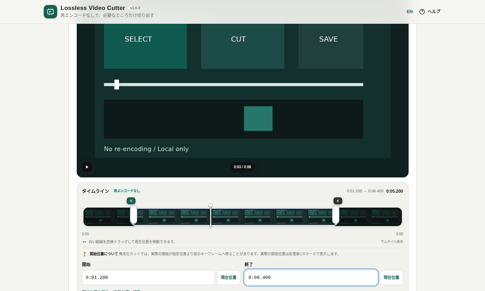
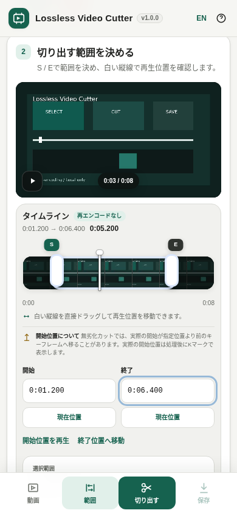

# Lossless Video Cutter

[](https://github.com/ttomohisa/htmlapps-lossless-video-cutter/actions/workflows/deploy-pages.yml)
[](LICENSE)
[](https://ttomohisa.github.io/htmlapps-lossless-video-cutter/)

[English README](README.md)

動画をアップロードせず、必要な範囲だけを**再エンコードなし**で切り出す単一HTMLアプリです。圧縮済みの映像・音声ストリームをそのまま新しいファイルへコピーするため、再圧縮による画質・音質の劣化を増やさず高速に処理できます。

## 🚀 デモ

### [GitHub PagesでLossless Video Cutterを開く](https://ttomohisa.github.io/htmlapps-lossless-video-cutter/)

GitHub Pagesから最初のHTMLを読み込んだ後、動画プレビュー、サムネイル生成、範囲指定、FFmpeg処理、保存・共有は端末内で行われます。選択した動画をアプリがサーバーへアップロードすることはありません。



<p align="center"></p>

## 主な機能

- 映像・音声を再エンコードせずに動画を切り出し
- MP4 / M4V / MOV / MKV / WebMコンテナに対応
- 動画編集アプリ風のサムネイル付きタイムライン
- S / Eハンドルで開始・終了を独立して指定
- 白い現在位置ラインを直接ドラッグしてプレビュー位置を移動
- 動画側の重複したネイティブシークバーは非表示
- 開始・終了時刻の直接入力と「現在位置」からの設定
- 動画の再生時間を取得できた場合は開始=0、終了=動画末尾を自動入力
- 音声だけを削除可能。映像は再エンコードしない
- 範囲を一度も変更せず動画全体を切り出す場合は確認を表示
- 別の動画へ切り替える前にも確認を表示
- 切り出し結果の保存ボタン近くで保存ファイル名を編集
- 切り出し完了後に保存・共有
- スマホでは「動画 / 範囲 / 切り出す / 保存」の固定操作バーを表示
- キーフレーム都合で開始位置が変わった場合、処理後に実開始位置を表示
- 開始位置の詳細は初期状態では閉じて表示
- 1つのHTML内で日本語 / Englishを切り替え
- SVG faviconとFFmpeg WASM runtimeをHTMLへ内包
- 大きな入力はWORKERFSで扱い、処理開始前にファイル全体をMEMFSへコピーしない

## すぐに使う

### Webで使う

[デモを開く](https://ttomohisa.github.io/htmlapps-lossless-video-cutter/)だけで利用できます。インストールやアカウント登録は不要です。

### 単一HTMLをダウンロードして使う

1. このリポジトリの `lossless-video-cutter.html` をビルドまたはダウンロードします。
2. 最新のChromium系ブラウザで開きます。その他のモダンブラウザでも、media / container対応状況に応じて利用できます。
3. 対応動画を選べばそのまま利用できます。

生成HTMLには、実行に必要なFFmpeg JavaScript / WebAssemblyが内包されています。

### ビルドして完全オフラインで使う（advanced）

1. このリポジトリをダウンロードまたはクローンします。
2. Windowsで `build-standalone.bat` をダブルクリックします。
3. 初回だけ、`dependencies.json` で固定したFFmpeg WASM Builder Releaseを取得します。
4. Release archiveを `SHA256SUMS.txt` と照合してからHTMLへ内包します。
5. 生成された `dist/index.html` を任意の場所へコピーすれば、以降はネットワーク接続なしで単体起動できます。

Python、Node.js、ローカルWebサーバーは不要です。ビルドにはWindows PowerShellを使用します。

## 使い方

1. 対応動画を選択するか、画面へドロップします。
2. **S** と **E** のハンドルを動かして残したい範囲を決めます。
3. 白い現在位置ラインをドラッグすると、範囲を変えずにプレビュー位置だけを移動できます。
4. 必要なら開始・終了の時刻入力や「現在位置」ボタンで細かく調整します。
5. 音声を残したくない場合は **音声を削除** をONにします。
6. **切り出す** を押します。開始・終了が動画全体のままなら、そのまま処理するか確認が表示されます。
7. 処理完了後、必要な場合だけ **開始位置の詳細** を開いて自動調整内容を確認します。
8. 結果欄の保存ボタン近くでファイル名を編集し、**保存** または **共有** を選びます。

### 「無劣化」と開始位置

このツールでいう「無劣化」は、圧縮済みの映像・音声をデコードして再エンコードしない、という意味です。**任意の1フレームを必ず先頭にできるという意味ではありません。**

H.264 / HEVCなどのフレーム間圧縮では、出力の先頭に単独で復号できるキーフレームが必要になる場合があります。たとえば `00:13.400` を指定しても、実際の開始位置が `00:12.967` へ移ることがあります。

その場合、処理後のタイムラインに **K** マーカーを表示し、指定開始と実際の開始の詳細は折りたたみ内で確認できます。

### タイムライン操作

- **S**：切り出し開始位置
- **E**：切り出し終了位置
- **白い縦線**：現在のプレビュー位置。直接つかんでいる間だけ移動
- **K**：キーフレーム調整が入った場合の実際の開始位置

ブラウザが元動画をプレビューできる場合は、小さなサムネイルを端末内で生成してタイムラインに並べます。ブラウザでプレビューできない形式でも、時刻を直接入力して切り出しを試せます。

### 現在位置のキーボード操作

| ショートカット | 操作 |
| --- | --- |
| `←` / `→` | 0.5秒ずつ移動 |
| `Shift` + `←` / `→` | 5秒ずつ移動 |
| `Home` | 動画の先頭へ移動 |
| `End` | 動画の最後へ移動 |
| `I` | 現在のプレビュー位置を範囲の開始に設定 |
| `O` | 現在のプレビュー位置を範囲の終了に設定 |

`I` / `O` を使う前に、Tab キーで白い現在位置ラインへフォーカスします。処理中でなく、プレビューのメタデータが利用できる場合だけ設定できます。修飾キーとの同時押し、長押しの繰り返し、文字変換中の入力では範囲を変更しません。不正な範囲や変更のない指定では、保存済みの切り出し結果を保持します。「現在位置」ボタンにも同じ確認を適用し、ブラウザーでプレビューできない動画でも時刻の直接入力と「範囲をリセット」は利用できます。

## GitHub Pagesで公開する

このリポジトリには、FFmpeg WASMを内包した単一HTMLをビルドしてGitHub Pagesへ自動公開するワークフローが含まれています。

1. リポジトリ名を `htmlapps-lossless-video-cutter` としてGitHubへプッシュします。
2. **Settings → Pages → Build and deployment → Source** で **GitHub Actions** を選択します。
3. `main` へプッシュするか、Actions画面から **Deploy standalone app to GitHub Pages** を手動実行します。
4. 成功後、`https://ttomohisa.github.io/htmlapps-lossless-video-cutter/` で利用できます。

`main` へのプッシュ時には、固定したFFmpeg WASM Releaseから単一HTMLを再生成し、Release archiveのSHA-256、実行時通信の遮断、生成物の構成を検証してから `dist/` を公開します。

GitHub Pagesがまだ有効になっていない場合も、ビルド・検証までは成功させ、ActionsのSummaryへ有効化手順を表示してデプロイだけをスキップします。

## 開発とビルド

```text
.
├─ src/index.template.html          # アプリ本体のテンプレート
├─ dependencies.json                # 固定したFFmpeg WASM Builder Release
├─ app.config.json                  # アプリ情報・出力設定
├─ build-standalone.bat             # Windows用ビルド入口
├─ build-standalone.ps1             # 単一HTML生成処理
├─ update-ffmpeg.bat                # FFmpeg WASM更新用ヘルパー
├─ scripts/
│  ├─ check-repository.ps1          # リポジトリ全体・ビルド検証
│  ├─ verify-standalone.ps1         # 単一HTML・通信遮断検証
│  ├─ build-self-extract.ps1        # 自己解凍HTML生成
│  └─ update-ffmpeg.ps1             # Release更新・失敗時ロールバック
├─ dist/
│  ├─ index.html                    # 生成される単一HTML
│  ├─ index.self-extract.html       # 自己解凍形式
│  └─ dependency-manifest.json      # 依存SHA-256・対応ソースURL
└─ .github/workflows/
   ├─ build-standalone.yml          # Pull Request時の単一HTML検証
   ├─ validate.yml                  # ソース・ビルド検証
   └─ deploy-pages.yml              # mainからPagesへ自動公開
```

通常のビルドでは、Browser Kittyや直接ダウンロード用として `dist/index.html` をリポジトリ直下の `lossless-video-cutter.html` にもコピーします。

### FFmpeg WASMを更新する

現在は **FFmpeg WASM Builder v1.1.0** の `lossless-video-cutter` profileを固定しています。

互換性のあるBuilder Releaseを公開したら、次のように更新できます。

```bat
update-ffmpeg.bat 1.2.0
```

`dependencies.json` の固定バージョンを変更 → Release取得 → SHA-256検証 → 再ビルドまで自動実行し、ビルドに失敗した場合は以前のバージョンへ戻します。

現在固定しているReleaseをキャッシュを破棄して取り直す場合：

```powershell
.\build-standalone.ps1 -ForceDownload
```

## プライバシーと通信防止

生成された単一HTMLには以下が含まれます。

- `connect-src 'none'` を含むContent Security Policy
- 外部runtime script / stylesheet / iframeに依存しない構成
- HTML内に埋め込んだ `ffmpeg.js` / `ffmpeg.wasm`
- Builder Release archiveのSHA-256記録
- `dist/dependency-manifest.json` に記録する対応ソースURLとSHA-256
- 選択したブラウザの `File` / `Blob` を読むWORKERFS

GitHub Pages版では最初のHTML配信は発生しますが、選択した動画の内容をアプリが外部へ送信することはありません。完全にネットワークを切って使う場合は、生成済みの `dist/index.html` をローカルで開いてください。オフライン確認手順は [VERIFY_OFFLINE.md](VERIFY_OFFLINE.md) を参照してください。

## 大きな動画とメモリ

入力と出力ではメモリの使い方が異なります。

- **入力:** WORKERFSでブラウザの `File` / `Blob` を必要な範囲だけ読むため、処理開始前に入力全体をMEMFSへコピーしません。
- **出力:** 完成ファイルは現在、ブラウザ / Emscriptenメモリ上に作ってからページへ返します。

そのため「1GBの動画から30秒だけ抜き出す」といった用途と特に相性がよい一方、非常に大きな動画のほぼ全編を切り出す場合は出力側で大きなメモリを使用します。

## 制限事項

- ストリームコピー方式のため、実際の開始位置が直前の復号可能なキーフレームへ移ることがあります。
- 任意フレーム完全一致のカットには境界付近の再エンコードが必要になるため、現在の設計対象外です。
- プレビューやサムネイルの可否は、ブラウザ自身のcodec / container対応状況に依存します。
- アプリprofileはMP4 / M4V / MOV / MKV / WebMに対応していますが、特殊なstreamとcontainerの組み合わせではremuxに失敗する場合があります。
- 出力はブラウザメモリ上に作成するため、非常に大きな出力は端末やブラウザのメモリ上限に達する場合があります。
- 共有はブラウザ / OSのWeb Share対応状況に依存します。共有できない場合は保存へフォールバックします。

## 使用コンポーネント

| コンポーネント | バージョン | ライセンス | 用途 |
| --- | ---: | --- | --- |
| FFmpeg WASM Builder | 1.1.0 | Builder/runtime sourceはMIT | 再現可能な小型WASMビルドとブラウザruntime |
| 生成FFmpeg core | Builder v1.1.0 `lossless-video-cutter` profile | LGPL-2.1-or-later | demux、seek、stream copy、remux |

生成するFFmpeg coreにはx264やVideo Compressor用のGPL profileは含めていません。詳細は [THIRD_PARTY_NOTICES.md](THIRD_PARTY_NOTICES.md) を参照してください。正確なRelease archive / 対応ソースのSHA-256は `dist/dependency-manifest.json` に記録されます。

## コントリビューション

バグ報告や機能提案はGitHub Issuesからお願いします。

## ライセンス

Copyright © 2026 ttomohisa

このリポジトリ自身のアプリケーションソースは [MIT License](LICENSE) で公開しています。

生成される単一HTMLには上記のLGPL-2.1-or-later FFmpeg coreも内包されます。MIT Licenseがその第三者コンポーネントを再ライセンスするものではありません。

### 安全な切り出しと回帰テスト

切り出し中は動画・範囲・音声設定を固定します。キャンセル後はすぐに再試行でき、古い処理の結果は保存欄へ表示されません。不正な時刻や変更のない時刻入力では、直前の有効な結果を保持します。「範囲をリセット」で音声や保存名の設定を変えずに動画全体へ戻せます。動画の変更・ファイル選択・ドロップによる置き換えには確認が入り、取り消すと現在の作業を保持します。

Node.js 24以降とPowerShellで `./scripts/check-repository.ps1` を実行してください。テンプレートと生成HTMLのUI回帰テスト、ネットワーク境界、FFmpegの検証済みビルド、自己展開版、ルート配布HTMLの一致を検証します。UIテストのみは `node --test tests/lossless-video-cutter.test.mjs` です。Worker・メディア情報は模擬し、実動画・ブラウザの確認は別途行います。
